# Diagramas de Flujo GMTCH Tune OS

Version: V1  
Fecha: 2026-06-25

Documento vivo de arquitectura y flujos operativos de GMTCH Tune OS, web publica, portal interno y Portal Masters/File Service. No incluye tokens, contrasenas ni datos sensibles.

## 1. Mapa General de Arquitectura

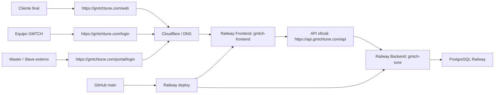

## 2. Flujo Web Publica

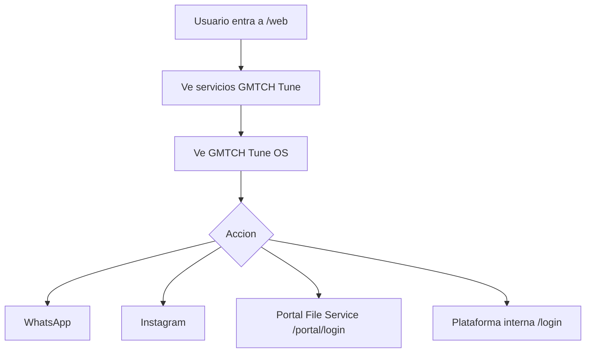

## 3. Flujo Interno GMTCH Tune OS

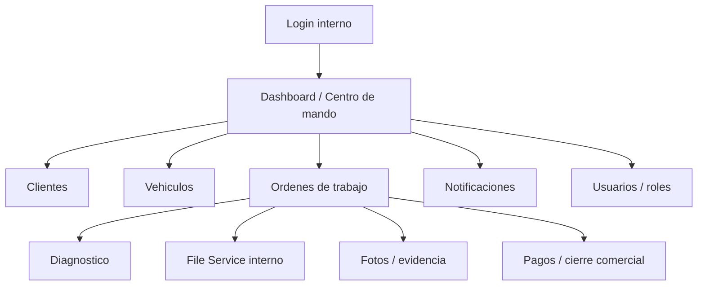

## 3.1 Centro de Mando Operativo V2

```mermaid
flowchart TD
  A["Dashboard interno"] --> B["Atencion inmediata"]
  A --> C["Semaforo operativo"]
  A --> D["Cola de trabajo del dia"]
  A --> E["File Service"]
  A --> F["Postventa tecnica / correcciones"]
  A --> G["Intervencion fisica"]
  A --> H["Acciones rapidas"]

  B --> B1["Correcciones tecnicas pendientes"]
  B --> B2["Archivos ECU pendientes"]
  B --> B3["Post escritura pendiente"]
  B --> B4["Nueva lectura requerida"]
  B --> B5["MOD listo"]
  B --> B6["Vehiculos listos para entrega"]
  B --> B7["Pagos pendientes antes de entrega"]

  C --> C1{"Estado general"}
  C1 -->|Verde| C2["Operacion normal"]
  C1 -->|Ambar| C3["Atencion requerida"]
  C1 -->|Rojo| C4["Bloqueo operativo"]

  D --> D1["Orden, cliente, vehiculo, estado y prioridad"]
  D1 --> D2["Responsable actual"]
  D2 --> D3["Proxima accion"]

  E --> E1["Pendiente revision"]
  E --> E2["En proceso"]
  E --> E3["MOD listo"]
  E --> E4["Correccion pendiente"]
  E --> E5["Nueva lectura requerida"]
  E --> E6["Post escritura pendiente"]

  F --> F1["Cliente volvio por DTC"]
  F --> F2["Responsable sugerido"]
  F --> F3["Estado de correccion"]
  F3 --> I["Notificacion interna, campana, alerta visual y sonido si aplica"]

  G --> G1["Mecanica asociada al servicio tecnico"]
  G --> G2["Mecanica independiente / mantencion"]
```

Regla: el Centro de Mando V2 prioriza bloqueos operativos, postventa tecnica, File Service, post escritura, pagos pendientes antes de entrega e intervencion fisica sin exponer caja a roles no autorizados.

## 4. Flujo Orden de Trabajo

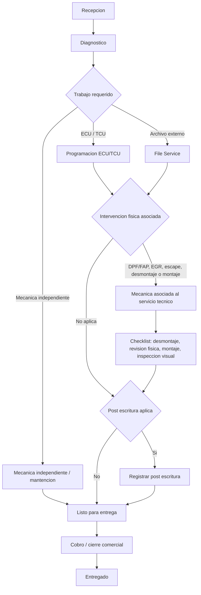

Regla: la mecanica asociada a DPF/FAP, EGR, SCR/AdBlue/DEF, linea de escape o desmontaje/montaje necesario forma parte del servicio tecnico ECU/File Service y no debe gestionarse como mantencion independiente. Servicio sujeto a evaluacion tecnica, normativa aplicable y uso autorizado segun corresponda.

## 5. Flujo Portal Masters / File Service

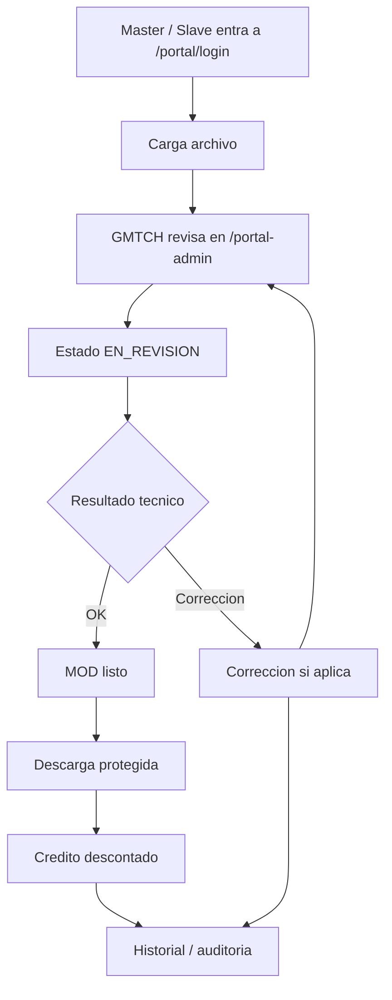

## 6. Flujo Nueva Lectura Requerida

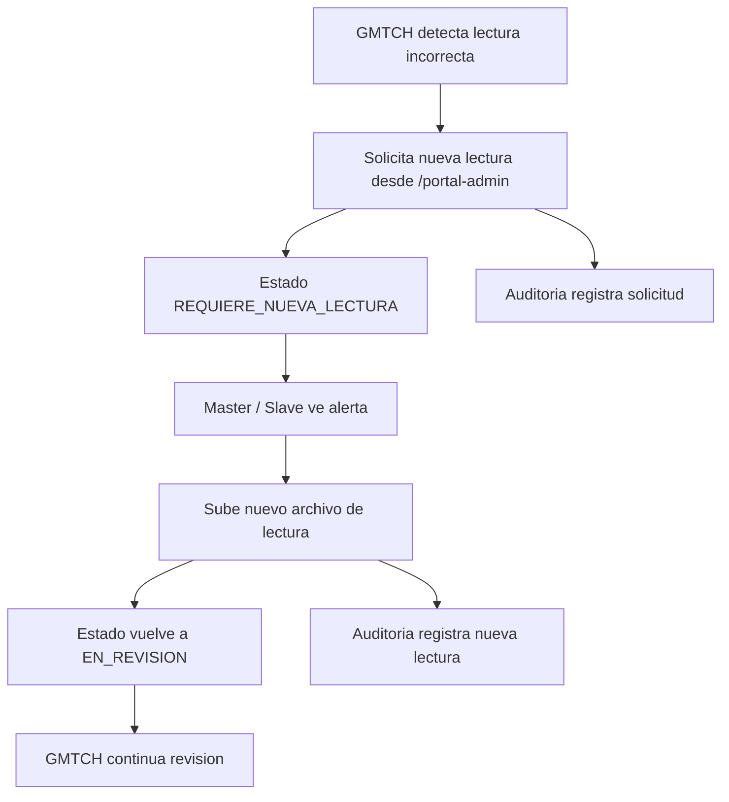

## 7. Flujo Correccion Postventa Tecnica Interna

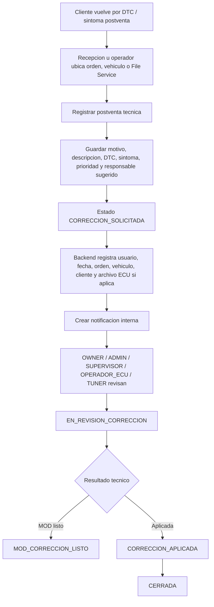

Regla: una correccion tecnica no marca pago, entrega ni cierre comercial. Es flujo tecnico/auditivo.

## 8. Flujo Bitacora Rapida Operativa

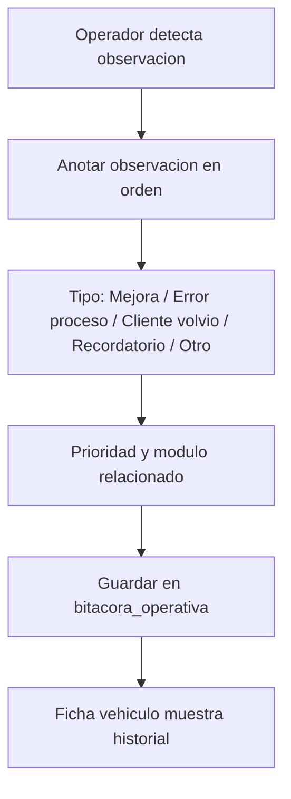

## 9. Flujo Notificaciones

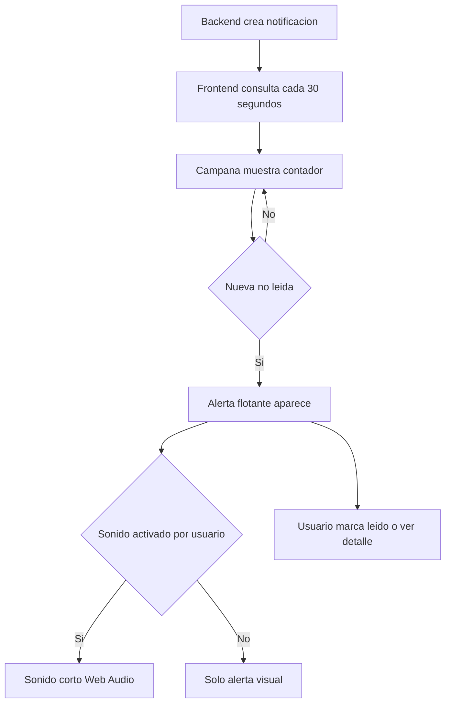

## 10. Flujo Dominios

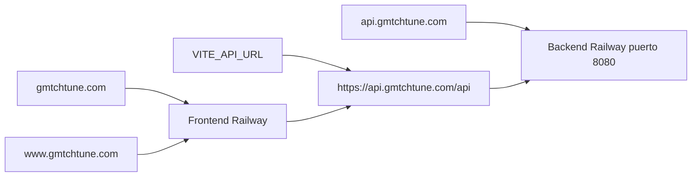

## 11. Regla de Mantenimiento

Este documento debe actualizarse cada vez que se cambie un flujo operativo, ruta critica, rol, portal, dominio, integracion, estado de File Service, pago, notificacion o arquitectura.
