# Diagramas de Flujo GMTCH Tune OS

Version: V1  
Fecha: 2026-06-25

Documento vivo de arquitectura y flujos operativos de GMTCH Tune OS, web publica, portal interno y Portal Masters/File Service. No incluye tokens, contrasenas ni datos sensibles.

## 1. Mapa General de Arquitectura

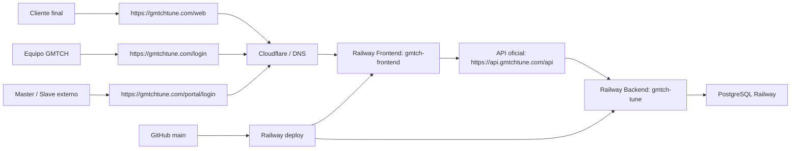

## 2. Flujo Web Publica

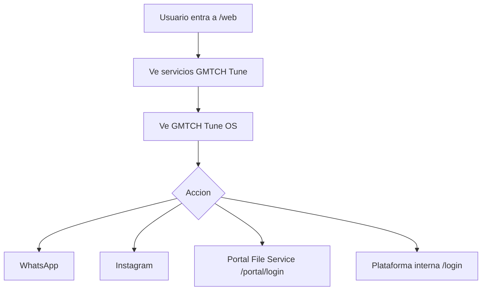

## 3. Flujo Interno GMTCH Tune OS

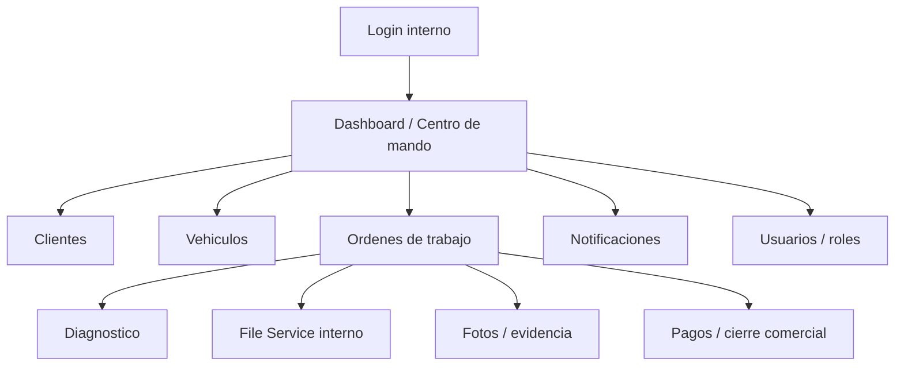

## 3.1 Centro de Mando Operativo V2

```mermaid
flowchart TD
  A["Dashboard interno"] --> B["Atencion inmediata"]
  A --> C["Semaforo operativo"]
  A --> D["Cola de trabajo del dia"]
  A --> E["File Service"]
  A --> F["Postventa tecnica / correcciones"]
  A --> G["Intervencion fisica"]
  A --> H["Acciones rapidas"]

  B --> B1["Correcciones tecnicas pendientes"]
  B --> B2["Archivos ECU pendientes"]
  B --> B3["Post escritura pendiente"]
  B --> B4["Nueva lectura requerida"]
  B --> B5["MOD listo"]
  B --> B6["Vehiculos listos para entrega"]
  B --> B7["Pagos pendientes antes de entrega"]

  C --> C1{"Estado general"}
  C1 -->|Verde| C2["Operacion normal"]
  C1 -->|Ambar| C3["Atencion requerida"]
  C1 -->|Rojo| C4["Bloqueo operativo"]

  D --> D1["Orden, cliente, vehiculo, estado y prioridad"]
  D1 --> D2["Responsable actual"]
  D2 --> D3["Proxima accion"]

  E --> E1["Pendiente revision"]
  E --> E2["En proceso"]
  E --> E3["MOD listo"]
  E --> E4["Correccion pendiente"]
  E --> E5["Nueva lectura requerida"]
  E --> E6["Post escritura pendiente"]

  F --> F1["Cliente volvio por DTC"]
  F --> F2["Responsable sugerido"]
  F --> F3["Estado de correccion"]
  F3 --> I["Notificacion interna, campana, alerta visual y sonido si aplica"]

  G --> G1["Mecanica asociada al servicio tecnico"]
  G --> G2["Mecanica independiente / mantencion"]
```

Regla: el Centro de Mando V2 prioriza bloqueos operativos, postventa tecnica, File Service, post escritura, pagos pendientes antes de entrega e intervencion fisica sin exponer caja a roles no autorizados.

## 4. Flujo Orden de Trabajo

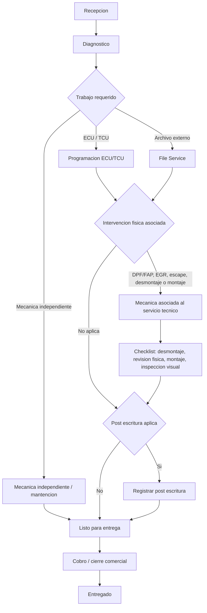

Regla: la mecanica asociada a DPF/FAP, EGR, SCR/AdBlue/DEF, linea de escape o desmontaje/montaje necesario forma parte del servicio tecnico ECU/File Service y no debe gestionarse como mantencion independiente. Servicio sujeto a evaluacion tecnica, normativa aplicable y uso autorizado segun corresponda.

## 5. Flujo File Service Interno

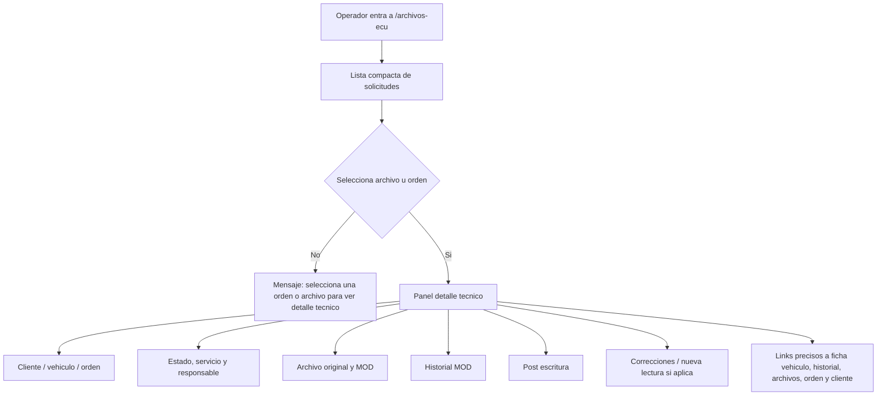

Regla: File Service interno debe evitar desplegar masivamente todas las fichas tecnicas. La lista muestra resumen operativo y el panel detalle muestra solo el archivo seleccionado.

## 6. Flujo Navegacion Precisa

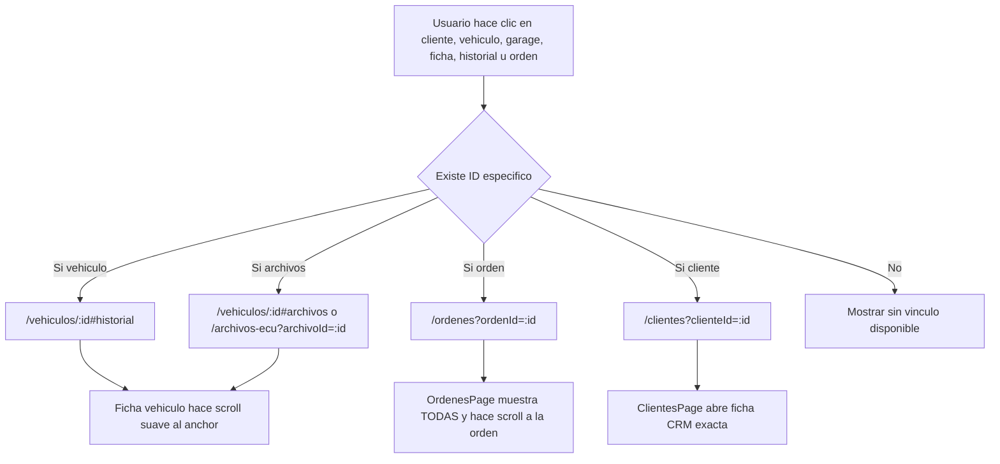

## 7. Flujo Portal Masters / File Service

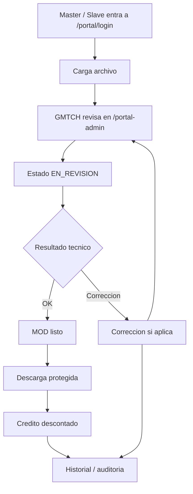

## 8. Flujo Nueva Lectura Requerida

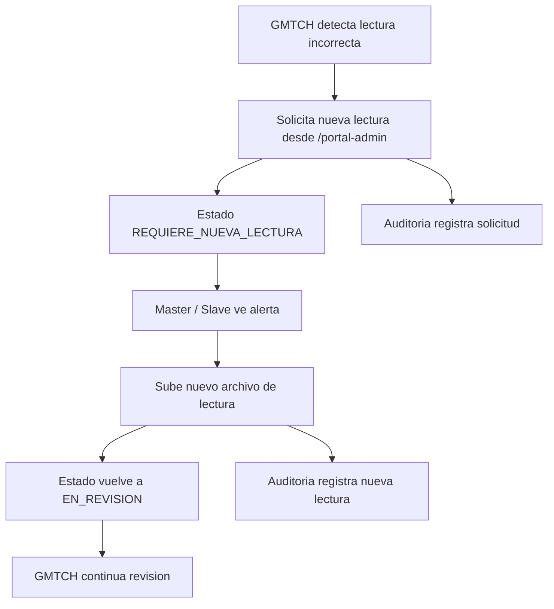

## 9. Flujo Correccion Postventa Tecnica Interna

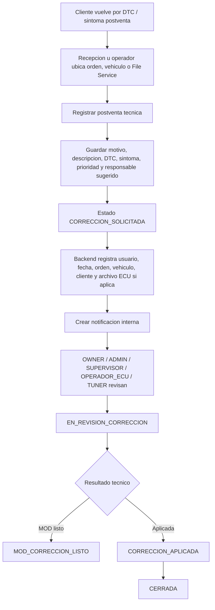

Regla: una correccion tecnica no marca pago, entrega ni cierre comercial. Es flujo tecnico/auditivo.

## 10. Flujo Bitacora Operativa Global

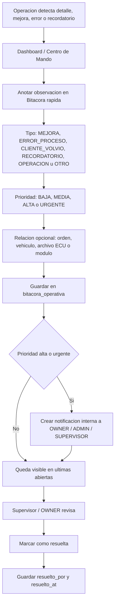

Regla: la bitacora operativa global sirve para no perder observaciones del dia. No reemplaza la postventa tecnica cuando existe una orden o un DTC claro; permite anotar rapido aunque todavia no se conozca la orden, vehiculo o archivo relacionado.

## 11. Flujo Finanzas Nucleo V1

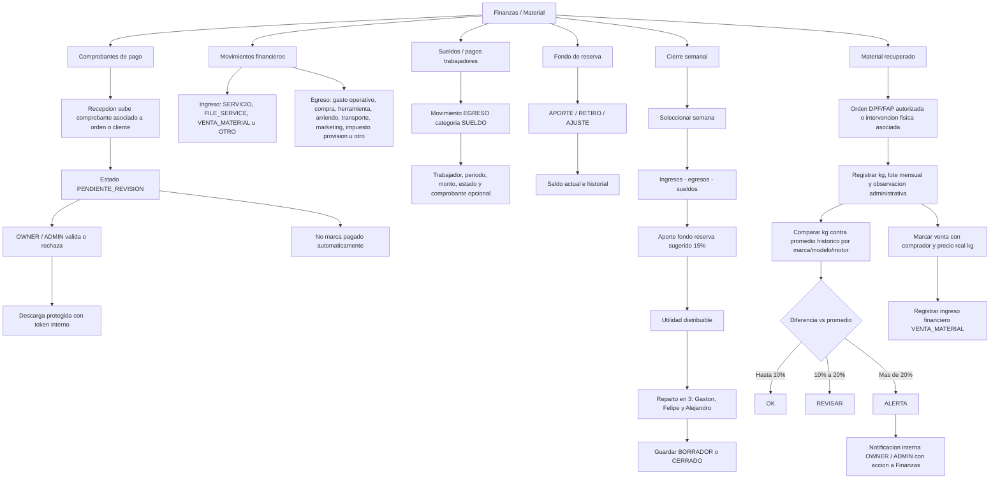

Regla: este flujo es administrativo/contable interno. No marca pagado ni entregado automaticamente. No entrega instrucciones tecnicas de extraccion, desmontaje o intervencion. Sueldos, utilidad, reparto y caja son visibles solo para roles autorizados.

## 12. Flujo Notificaciones

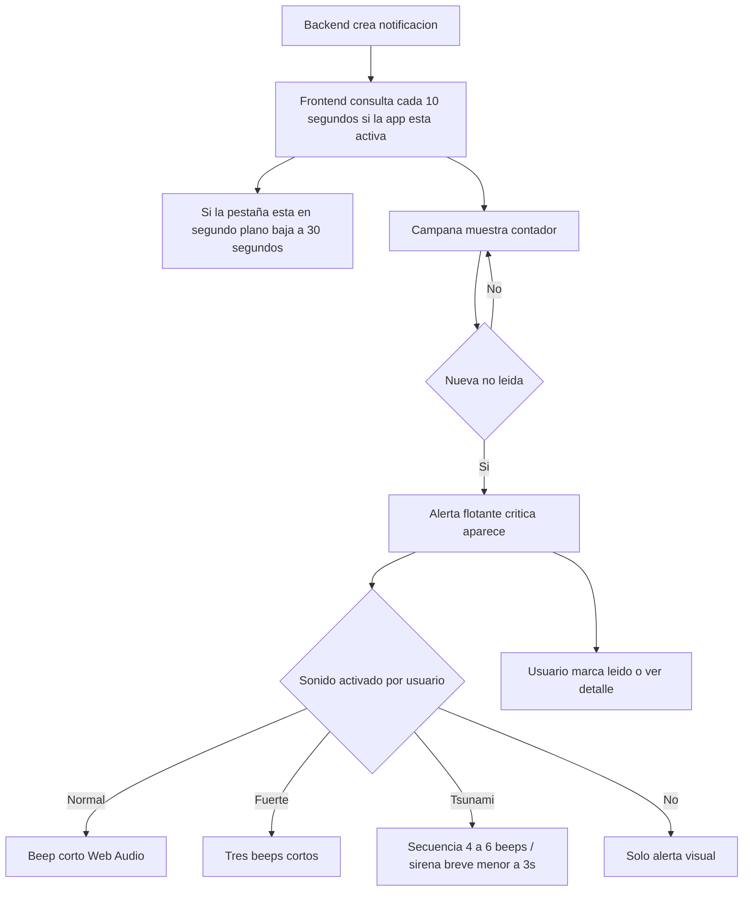

Regla: el modo tsunami es opcional y se usa solo en recepcion/taller cuando se requiere maxima atencion. No debe sonar infinitamente ni repetirse por notificaciones antiguas.

## 12.1 Flujo Notificaciones Accionables

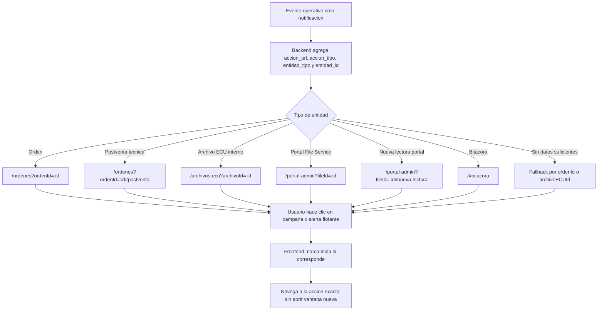

Regla: toda notificacion nueva debe incluir una accion directa cuando conozca la orden, archivo ECU, solicitud portal, cliente, vehiculo, bitacora o postventa relacionada. Las notificaciones antiguas usan fallback por `ordenId`, `archivoECUId` o metadata disponible.

## 13. Flujo Dominios

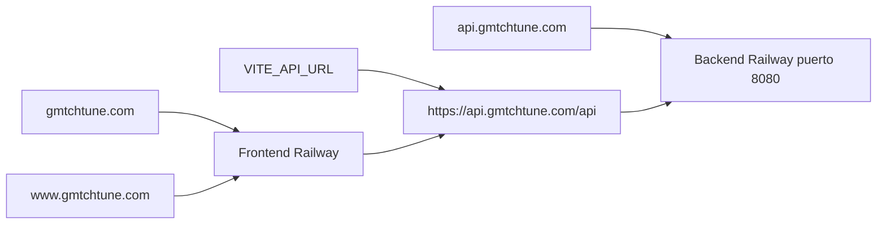

## 14. Regla de Mantenimiento

Este documento debe actualizarse cada vez que se cambie un flujo operativo, ruta critica, rol, portal, dominio, integracion, estado de File Service, pago, notificacion o arquitectura.
